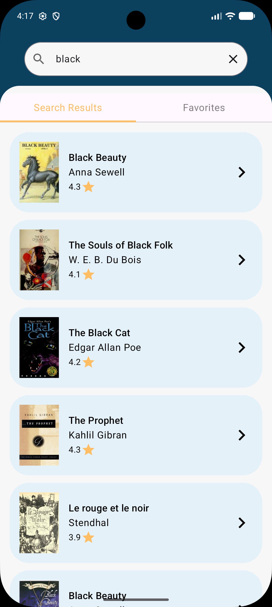
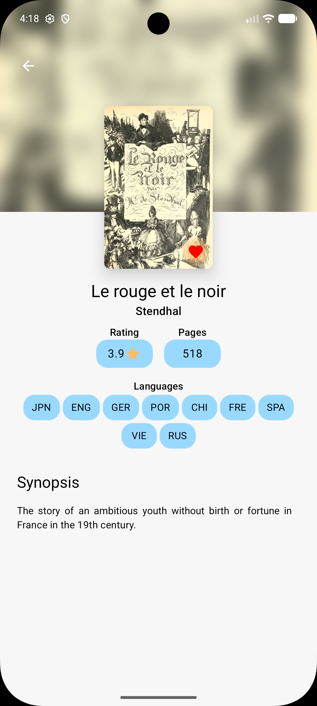
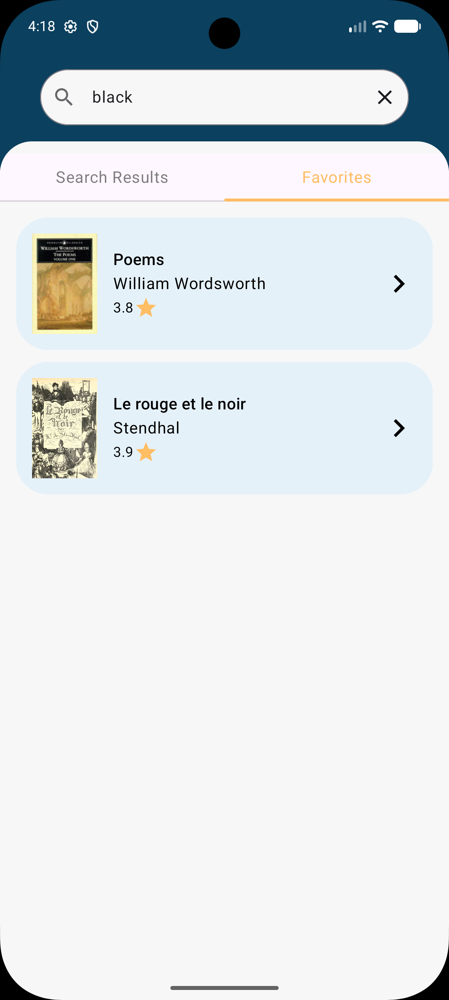

<p align="center">
  
  
  
  
</p>

<h1 align="center">
  <br>
    Dokusho
  <br>
</h1>

<h3 align="center">
  <em>A beautiful cross-platform book discovery app built with Kotlin Multiplatform & Compose Multiplatform</em>
</h3>

<p align="center">
  <strong>Dokusho</strong> (読書 — Japanese for <em>"reading"</em>) lets you search millions of books via the <a href="https://openlibrary.org">Open Library API</a>, explore detailed book information, and curate your personal favorites collection — all from a single shared codebase that runs natively on Android, iOS, and Desktop.
</p>

---

## Screenshots

<p align="center">
  
  &nbsp;&nbsp;
  
  &nbsp;&nbsp;
  
</p>


---

## Features

- **Book Search** — Search millions of books powered by the Open Library API with real-time query debouncing
- **Book Details** — Rich detail view with blurred cover background, ratings, page count, languages, and synopsis
- **Favorites** — Save books to your local favorites collection with offline persistence via Room database
- **Swipeable Tabs** — Smooth horizontal pager to switch between search results and favorites
- **Animated Transitions** — Polished slide-in/slide-out navigation transitions between screens
- **Cross-Platform** — Runs natively on Android, iOS, and Desktop from a single Kotlin codebase

---

## Tech Stack

| Layer | Technology |
|---|---|
| **UI** | [Compose Multiplatform](https://www.jetbrains.com/compose-multiplatform/) + Material 3 |
| **Navigation** | [Navigation Compose](https://www.jetbrains.com/help/kotlin-multiplatform-dev/compose-navigation-routing.html) (Type-safe routes) |
| **Networking** | [Ktor Client](https://ktor.io/) + Kotlinx Serialization |
| **Image Loading** | [Coil 3](https://coil-kt.github.io/coil/) (Multiplatform) |
| **Local Database** | [Room](https://developer.android.com/training/data-storage/room) (KMP) + SQLite Bundled |
| **Dependency Injection** | [Koin](https://insert-koin.io/) |
| **Architecture** | Clean Architecture + MVVM |
| **Language** | [Kotlin 2.0](https://kotlinlang.org/) |

---

## Architecture

```
dokusho/
├── core/
│   ├── data/          # HTTP client factory, safe API call wrapper
│   ├── domain/        # Result type, Error types
│   └── presentation/  # Theme colors, UiText, error mapping
├── book/
│   ├── domain/        # Book model, BookRepository interface
│   ├── data/
│   │   ├── dto/       # API response models (SearchResponseDto, BookWorkDto)
│   │   ├── network/   # Ktor data source (Open Library API)
│   │   ├── database/  # Room entities, DAO, type converters
│   │   ├── mappers/   # DTO ↔ Domain model mappers
│   │   └── repository/# Repository implementation
│   └── presentation/
│       ├── book_list/  # Search screen + Favorites tab
│       └── book_detail/# Detail screen with blurred background
├── di/                # Koin modules (shared + platform-specific)
└── app/               # App entry point, navigation graph, routes
```

The app follows **Clean Architecture** with a unidirectional data flow:

```
UI (Compose) → ViewModel → Repository → DataSource (Ktor / Room)
```

Each screen has its own `State`, `Action`, and `ViewModel`, keeping the presentation layer predictable and testable.

---

## Getting Started

### Prerequisites

- **JDK 11+**
- **Android Studio Ladybug** (2024.2.1) or later
- **Kotlin Multiplatform plugin** installed
- **Xcode 15+** (for iOS builds)

### Run on Android

```bash
./gradlew :androidApp:installDebug
```

Or open the project in Android Studio and run the `androidApp` configuration.

### Run on Desktop (JVM)

```bash
./gradlew :androidApp:run
```

### Run on iOS

Open `iosApp/iosApp.xcodeproj` in Xcode and run on a simulator or device.

---

## Project Structure

```
Dokusho/
├── androidApp/               # Shared KMP module (despite the name)
│   └── src/
│       ├── commonMain/       # Shared Kotlin + Compose code
│       ├── androidMain/      # Android-specific (Activity, DI, DB factory)
│       ├── desktopMain/      # Desktop-specific (Window, DI, DB factory)
│       └── iosMain/          # iOS-specific (ViewController, DI, DB factory)
├── iosApp/                   # iOS entry point (Xcode project)
├── gradle/
│   └── libs.versions.toml    # Version catalog
└── build.gradle.kts          # Root build config
```

---

## API

Dokusho uses the **[Open Library API](https://openlibrary.org/developers/api)** — a free, open-source API with data on millions of books.

| Endpoint | Purpose |
|---|---|
| `GET /search.json` | Search books by query |
| `GET /works/{id}.json` | Get detailed book information |

No API key required.

---

## Color Palette

The app uses a distinctive warm color scheme:

| Color | Hex | Usage |
|---|---|---|
| **Dark Blue** | `#0B405E` | Primary background, headers |
| **Sand Yellow** | `#FFBD64` | Accents, indicators, favorites |
| **Desert White** | `#F7F7F7` | Content background |
| **Light Blue** | `#9AD9FF` | Secondary accents |

---

## Contributing

1. Fork the repository
2. Create your feature branch (`git checkout -b feature/amazing-feature`)
3. Commit your changes (`git commit -m 'Add amazing feature'`)
4. Push to the branch (`git push origin feature/amazing-feature`)
5. Open a Pull Request

---

## License

This project is licensed under the MIT License — see the [LICENSE](LICENSE) file for details.

---

## Acknowledgments

- [Open Library](https://openlibrary.org) for the free book data API
- [JetBrains](https://www.jetbrains.com) for Kotlin Multiplatform and Compose Multiplatform
- The KMP community for the ecosystem of multiplatform libraries

---

<p align="center">
  <sub>Built with Kotlin Multiplatform & Compose Multiplatform</sub>
</p>
